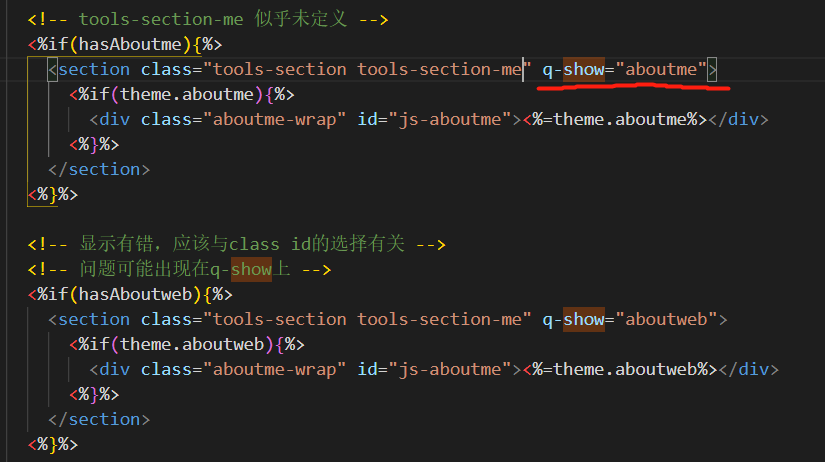

# halfghost.cn

### 项目说明

​	创建属于我空间，讲述所思所想，寻求一个荒唐的答案，没有欺骗，只有隐瞒 。

### 更新日志

+   2021年4月29日14点16分

    +   参考这个[issue](https://github.com/litten/hexo-theme-yilia/issues/715)，修改aboutweb的配置，并注释掉fix.js中的转义函数，aboutweb成功解释了
    +   但是用同样的方法处理aboutme却不行……
    
+   2021年4月29日14点00分

    +   不知道什么原因，修改不生效，还不清楚q-show的含义
    
        
    
    +   其中aboutme能正常解释，而aboutweb且不能，两者只有q-show有差异
    
+   2021年4月29日13点07分

    +   去除网站右下角power by功能
    +   **修改tools.ejs等文件**，引入aboutweb功能
    
+   2021年4月28日23点41分

    +   简单研究了hexo模板，大概明白如何自定义——修改theme下的layout文件
    +   明天按照[教程](https://hexo.io/zh-cn/docs/templates)，进一步设计
    +   在yilia的基础上自定义一个主题模板
    
+   2021年4月24日23点42分

    +   沉寂了一个多月，决定回来更新
    +   决定开始记述往事，表达自己的观念。是的，**如果不敢接受过去，凭什么面对未来**。过去已成定局，既然无法改变，那就直面它，接受它，逃避，只会浪费时间错过机会，绝不能改变什么。
    +   就这样吧，没什么好畏惧的，尴尬也好，被人嘲笑玩弄也罢，就像有山先生那样，活得自我一点，洒脱一点，世间本没有那么多枷锁约束，不过是发自内心的畏惧，阻碍了自己。
    +   另外，后面再慢慢尝试重构网页结构，目前它还存在比较多的缺陷，想办法解决它。**时间在流逝，宁愿犯错功亏一篑，也不可毫无作为**。
    
+   2021年3月5日12点10分

    +   添加显示网页运行时间功能
    
+   2021年3月2日21点46分

    +   添加不蒜子访问统计功能
    
+   2021年3月2日12点43分

    +   完善了细节
    +   初步了解hexo模板的实现方式，后面可以尝试进行个性化设计
    
+   2021年3月2日00点10分

    +   修改了主题，觉得[这个](https://github.com/litten/hexo-theme-yilia)更合适
    +   目前大体架构都调整好了，还有一些细节需要继续研究
    +   部署到GitHub时README文档被转化为html了。需要修改配置文件
    
+   2021年2月20日13点59分

    +   使用 [nexmoe](https://github.com/theme-nexmoe/hexo-theme-nexmoe)主题搭建了网站
    +   仍存在很多缺陷，需要尝试读懂hexo主题的格式，然后自己修改设计
    
+   2021年2月20日11点13分

    ​	一直想创建个小网站，从去年暑假开始学习 html/css/js 以及 node.js 等基础知识，大概是十月份注册了域名halfghost.cn，本想着立刻开始大展身手，可是当时学业功课过于繁杂，我没有足够的时间精力去顾及它，就不断耽搁延后……
    
    ​	本计划在寒假开始专心捣鼓，但因为这学期一直在各种肝，到最后累了乏了，学不动了，就想放松放松(~~于是整个寒假都在看小说~~)。

    ​	直到今天，突然想起这事——嗯，是时候开始了。

    ​	可惜目前掌握的知识还远远不够，不足以随心所欲地搭建，而且暂时不需要动态网站的效果，所以就先尝试借助模板，简单搭建一个静态网站——至少是从无到有的过程~
    
    ​	参阅不少资料，最终使用基于 node.js 的 hexo 模板。

### 其它

